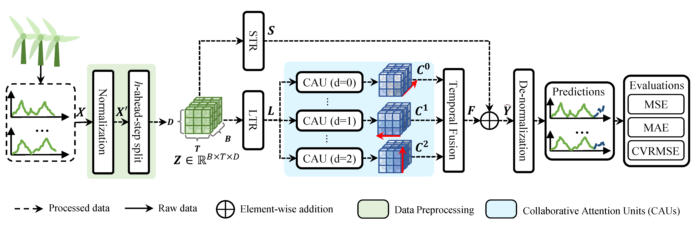

<div align="center">
  <h1><b> (APEN'2024) Temporal Collaborative Attention for Wind Power Forecasting </b></h1>
</div>


<div align="center">

[//]: # (**[<a href="https://www.sciencedirect.com/science/article/pii/S0306261923018664">ScienceDirect</a>]**)
**[<a href="https://doi.org/10.1016/j.apenergy.2023.122502">Doi</a>]**
**[<a href="apen2024-Hu%20(Temporal%20collaborative%20attention%20for%20wind%20power%20forecasting).pdf">PDF</a>]**
**[<a href="https://scholar.google.com.hk/citations?user=3BZDW4oAAAAJ">Google Scholar</a>]**

</div>


---

The complete implementation of the **TCOAT** model is provided in [**model_tcoat.py**](model_tcoat.py) within this
repository.

---

## Updates

🚩 **News** (2025.08): TCOAT has been included in [[**pyFAST**]](https://github.com/freepose/pyFAST). For implementation
details, see the [**TCOAT model code**](https://github.com/freepose/pyFAST/blob/main/fast/model/mts/coat.py) in pyFAST's
MTS module.

## Overall Architecture



## Requirements

- Python 3.10+
- PyTorch 2.0.0+

## Contact

If you have any questions or suggestions, feel free to contact me at [yuehu.xm@gmail.com](mailto:yuehu.xm@gmail.com).

## Citation

If you find this work useful in your research, please use the following citation formats:

**BibTeX format:**

```bibtex
@article{art/apen2024/357Hu,
    author = {Hu, Yue and Liu, Hanjing and Wu, Senzhen and Zhao, Yuan and Wang, Zhijin and Liu, Xiufeng},
    title = {Temporal Collaborative Attention for Wind Power Forecasting},
    journal = {Applied Energy},
    volume = {357},
    pages = {122502},
    year = {2024},
    doi = {10.1016/j.apenergy.2023.122502},
}
```

**APA/Plain format:**

```
Yue Hu, Hanjing Liu, Senzhen Wu, Yuan Zhao, Zhijin Wang, and Xiufeng Liu. 2024. Temporal Collaborative Attention for
Wind Power Forecasting. Applied Energy, 357, 122502. https://doi.org/10.1016/j.apenergy.2023.122502
```